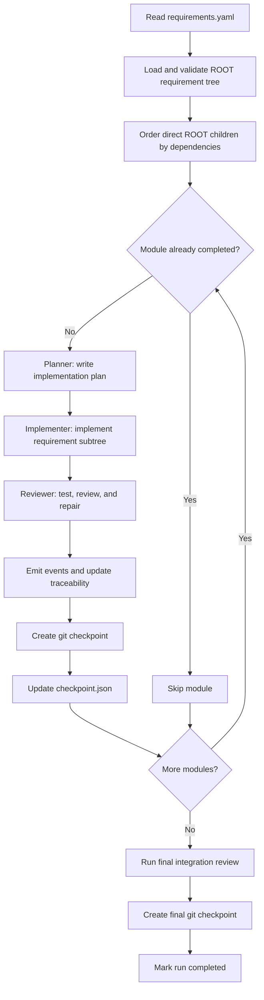

# HAFleet ARC

HAFleet ARC is a finite-lifecycle multi-role coding agent for ARC-Bench. It keeps
HAFleet's planner, implementer, reviewer, task-state, and checkpoint concepts but
does not start the HAFleet backend, tmux, Matrix, or dashboard services.

## Entrypoint

ARC-Bench runs the submission as:

```bash
python3 main.py /path/to/requirements --output-dir /path/to/output --type web
```

The ARC-Bench runtime SDK is vendored under `arcbench-agent-runtime/`. Direct
source-tree runs discover it automatically, so no external checkout or manual
`PYTHONPATH` is needed.

The runner supplies `OPENAI_API_KEY`, `OPENAI_BASE_URL`, `MODEL`, and all
`ARCBENCH_*` runtime paths. The requirement bundle must contain a ROOT
`requirements.yaml`.

Codex local state is isolated under `.arc/hafleet/codex-home` because evaluation
hosts may expose a read-only home directory.

## Fleet workflow

HAFleet ARC runs a finite, resumable pipeline over the requirement tree. The
three Codex roles share the same output workspace and keep persistent role
threads for the duration of the run.



### 1. Initialize the workspace

The entrypoint validates that the requirement bundle contains a
`requirements.yaml` whose root node has `id: ROOT` and at least one child. It
then:

- copies optional starter files from `template/` without overwriting resumed
  work;
- initializes the ARC-Bench traceability store and records the requirement
  tree;
- ensures that the output directory is a git repository;
- emits the run-started event; and
- isolates Codex state under `.arc/hafleet/codex-home` so the runner does not
  need a writable user home directory.

### 2. Build the module execution plan

Each direct child of `ROOT` becomes one module. Modules are processed in stable,
dependency-aware order. Dependencies on descendants do not constrain this
top-level ordering, and dependency cycles fall back to source order instead of
deadlocking the run.

### 3. Plan the module

The `planner` receives the complete requirement subtree, task type, previously
completed module IDs, and current repository context. It writes a concrete
implementation plan to:

```text
.arc/hafleet/plans/<module-id>.md
```

The plan covers the data model, routes or UI, persistence, validation,
requirement scenarios, and verification. The planner does not modify project
files outside the plan.

### 4. Implement the requirement subtree

The `implementer` reads the coordinator plan and implements the entire subtree
in the shared output workspace. It must preserve behavior from earlier modules,
build real persisted behavior rather than static mock screens, and run focused
checks while working.

### 5. Review and repair

The `reviewer` checks the implementation against its scenarios, runs practical
tests or build checks, and directly repairs every defect it finds. The review
also covers cross-module regressions, persistence, permissions, validation, and
visible UI behavior.

When the module passes review, the orchestrator:

1. emits ARC-Bench design and implementation events;
2. creates a git checkpoint named
   `<module-id>: implement and review <module-name>`; and
3. records the completed module in `.arc/checkpoint.json`.

### 6. Pause and resume

The orchestrator checks for an ARC-Bench pause request at phase boundaries. On
pause it records the current module and phase, emits a paused event, and exits
with status `130`.

On the next run, modules already listed as completed in the checkpoint are
skipped. Resume is therefore module-granular: a partially completed module is
run again, while earlier completed modules are retained.

### 7. Run the final integration review

After all modules are complete, the `reviewer` performs one whole-project
integration pass. It runs the build and practical tests, repairs regressions and
integration gaps, and leaves the application runnable without starting a
long-running server. The resulting checkpoint commit is:

```text
ROOT: final HAFleet integration review
```

Set `HAFLEET_FINAL_REVIEW=0` to disable this pass for cheaper local experiments.

## Local checks

```bash
python3 -m unittest discover -s tests -v
python3 -m compileall -q main.py hafleet_arc tests
```

For submission, keep `main.py`, `hafleet_arc/`, `arcbench-agent-runtime/`,
`requirements.txt`, and optional `skills/` at the ZIP root.
