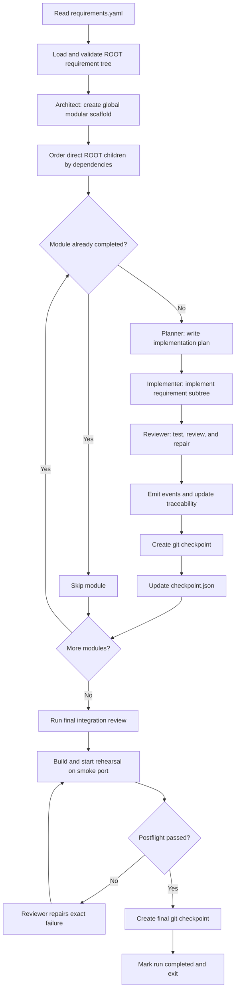

# HAFleet ARC

HAFleet ARC is a finite-lifecycle multi-role coding agent for ARC-Bench. It keeps
HAFleet's architect, planner, implementer, reviewer, task-state, and checkpoint concepts but
does not start the HAFleet backend, tmux, Matrix, or dashboard services.

## Entrypoint

ARC-Bench runs the submission as:

```bash
python3 main.py /path/to/requirements --output-dir /path/to/output --type web --web-port 3000
```

The ARC-Bench runtime SDK is vendored under `arcbench-agent-runtime/`. Direct
source-tree runs discover it automatically, so no external checkout or manual
`PYTHONPATH` is needed.

The runner supplies `OPENAI_API_KEY`, `OPENAI_BASE_URL`, `MODEL`, and all
`ARCBENCH_*` runtime paths. The requirement bundle must contain a ROOT
`requirements.yaml`.

Codex local state is isolated under `.arc/hafleet/codex-home` because evaluation
hosts may expose a read-only home directory.

## Fleet workflow

HAFleet ARC runs a finite, resumable pipeline over the requirement tree. The
four Codex roles share the same output workspace and keep persistent role
threads for the duration of the run.



### 1. Initialize the workspace

The entrypoint validates that the requirement bundle contains a
`requirements.yaml` whose root node has `id: ROOT` and at least one child. It
then:

- copies the task-specific starter from `template/<type>/` without overwriting
  resumed work;
- initializes the ARC-Bench traceability store and records the requirement
  tree;
- ensures that the output directory is a git repository;
- emits the run-started event; and
- isolates Codex state under `.arc/hafleet/codex-home` so the runner does not
  need a writable user home directory.

### 2. Create the global architecture scaffold

Before processing feature modules, the one-time `architect` role reads the complete
ROOT requirement tree, writes `.arc/hafleet/architecture.md`, and creates or refactors
a modular project scaffold. Its checkpoint is `ROOT: architecture scaffold`, and the
`architecture_completed` flag makes the phase resumable without repeating it.

架构完成后也可以开启并行 worktree 模式，为相互独立的 ROOT 模块分别派发 agent：

```bash
python3 main.py /path/to/requirements \
  --output-dir /path/to/output \
  --type web \
  --parallel \
  --max-workers 2
```

并行模式默认关闭，也可以通过 `HAFLEET_PARALLEL=1` 和
`HAFLEET_MAX_WORKERS=2` 开启。每个模块在独立 worktree 中完成 planner、
implementer、reviewer 后，主工作区按依赖顺序 cherry-pick；成功 worktree 会清理，
失败或冲突 worktree 会保留在 `.arc/hafleet/worktrees/`。

### 3. Build the module execution plan

Each direct child of `ROOT` becomes one module. Modules are processed in stable,
dependency-aware order. Dependencies on descendants do not constrain this
top-level ordering, and dependency cycles fall back to source order instead of
deadlocking the run.

### 4. Plan the module

The `planner` receives the complete requirement subtree, task type, previously
completed module IDs, and current repository context. It writes a concrete
implementation plan to:

```text
.arc/hafleet/plans/<module-id>.md
```

The plan covers the data model, routes or UI, persistence, validation,
requirement scenarios, and verification. The planner does not modify project
files outside the plan.

### 5. Implement the requirement subtree

The `implementer` reads the coordinator plan and implements the entire subtree
in the shared output workspace. It must preserve behavior from earlier modules,
build real persisted behavior rather than static mock screens, and run focused
checks while working.

### 6. Review and repair

The `reviewer` checks the implementation against its scenarios, runs practical
tests or build checks, and directly repairs every defect it finds. The review
also covers cross-module regressions, persistence, permissions, validation, and
visible UI behavior.

When the module passes review, the orchestrator:

1. emits ARC-Bench design and implementation events;
2. creates a git checkpoint named
   `<module-id>: implement and review <module-name>`; and
3. records the completed module in `.arc/checkpoint.json`.

### 7. Pause and resume

The orchestrator checks for an ARC-Bench pause request at phase boundaries. On
pause it records the current module and phase, emits a paused event, and exits
with status `130`.

On the next run, modules already listed as completed in the checkpoint are
skipped. Resume is therefore module-granular: a partially completed module is
run again, while earlier completed modules are retained.

### 8. Run the final integration review

After all modules are complete, the `reviewer` performs one whole-project
integration pass. It runs the build and practical tests, repairs regressions and
integration gaps, and leaves the application runnable without starting a
long-running server. The resulting checkpoint commit is:

```text
ROOT: final HAFleet integration review
```

Set `HAFLEET_FINAL_REVIEW=0` to disable this pass for cheaper local experiments.

### 9. Validate the delivery and exit

For web tasks, HAFleet ARC does not report completion immediately after the
final review. It first verifies the required `frontend/` and `backend/`
structure, runs the same npm install and frontend build sequence as the grader,
then starts the backend on the isolated smoke port and waits for an HTTP
response. A failed postflight is sent back to the reviewer with the exact error
for up to two repair passes.

Only a successful postflight creates the final git checkpoint, marks the
checkpoint complete, emits the run-completed event, and exits with status `0`.
All rehearsal processes are stopped before exit.

## Reliability controls

Each Codex turn has a finite timeout. Transient overload, authentication,
connection, streaming, and timeout failures are retried with a fresh role
thread. A successful turn with neither a response nor project file changes is
treated as an empty turn and retried as well.

During web generation, commands launched by Codex inherit the smoke port
(default `3100`). A workspace-scoped guard stops only this submission's
processes if they bind the grading port (default `3000`); it never kills a
foreign listener on a shared runner.

| Environment variable | Default | Purpose |
| --- | ---: | --- |
| `HAFLEET_MAX_ATTEMPTS` | `3` | Maximum attempts for one Codex role turn |
| `HAFLEET_RETRY_DELAYS` | `30,60` | Comma-separated retry delays in seconds |
| `HAFLEET_TURN_TIMEOUT` | `1200` | Maximum seconds for one Codex turn |
| `HAFLEET_SMOKE_PORT` | `3100` | Safe generation-time application port |
| `HAFLEET_POSTFLIGHT_REPAIRS` | `2` | Reviewer repair attempts after failed rehearsal |
| `HAFLEET_NPM_TIMEOUT` | `600` | Timeout for each postflight npm command |
| `HAFLEET_READY_TIMEOUT` | `45` | Backend readiness timeout during rehearsal |
| `HAFLEET_FINAL_REVIEW` | `1` | Enable the whole-project reviewer pass |
| `HAFLEET_POSTFLIGHT` | `1` | Enable the mandatory delivery rehearsal |
| `HAFLEET_PARALLEL` | `0` | Enable independent ROOT module worktrees |
| `HAFLEET_MAX_WORKERS` | `2` | Maximum concurrent parallel module worktrees |

`HAFLEET_FINAL_REVIEW=0` skips the optional model review but still runs the
deterministic postflight. `HAFLEET_POSTFLIGHT=0` is intended only for cheap
local harness tests; disabling it removes the runnable-delivery guarantee.

## Local checks

```bash
python3 -m unittest discover -s tests -v
python3 -m compileall -q main.py hafleet_arc tests
```

For submission, keep `main.py`, `hafleet_arc/`, `arcbench-agent-runtime/`,
`template/`, `requirements.txt`, and optional `skills/` at the ZIP root.
