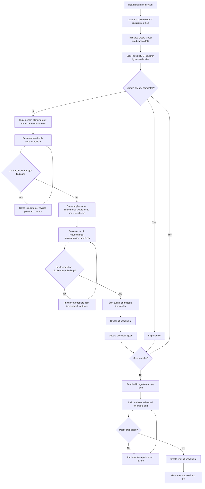

[English](README.md) | [中文](README.zh-CN.md)

# HAFleet ARC

HAFleet ARC is a finite-lifecycle multi-role coding agent for ARC-Bench. It keeps
HAFleet's architect, implementer, reviewer, task-state, and checkpoint concepts but
does not start the HAFleet backend, tmux, Matrix, or dashboard services.

## Entrypoint

ARC-Bench runs the submission as:

```bash
python3 main.py /path/to/requirements --output-dir /path/to/output --type web --web-port 3000
```

The ARC-Bench runtime SDK is vendored under `arcbench-agent-runtime/`. Direct
source-tree runs discover it automatically, so no external checkout or manual
`PYTHONPATH` is needed.

The runner supplies `OPENAI_API_KEY`, `OPENAI_BASE_URL`, `MODEL`, and all
`ARCBENCH_*` runtime paths. The requirement bundle must contain a ROOT
`requirements.yaml`.

Codex local state is isolated under `.arc/hafleet/codex-home` because evaluation
hosts may expose a read-only home directory.

## Fleet workflow

HAFleet ARC runs a finite, resumable pipeline over the requirement tree. The
Core Codex roles share the same output workspace and keep persistent role
threads for the duration of the run.



### 1. Initialize the workspace

The entrypoint validates that the requirement bundle contains a
`requirements.yaml` whose root node has `id: ROOT` and at least one child. It
then:

- copies the task-specific starter from `template/<type>/` without overwriting
  resumed work;
- initializes the ARC-Bench traceability store and records the requirement
  tree;
- ensures that the output directory is a git repository;
- emits the run-started event; and
- isolates Codex state under `.arc/hafleet/codex-home` so the runner does not
  need a writable user home directory.

### 2. Create the global architecture scaffold

Before processing feature modules, the one-time `architect` role reads the complete
ROOT requirement tree, writes `.arc/hafleet/architecture.md`, and creates or refactors
a modular project scaffold. Its checkpoint is `ROOT: architecture scaffold`, and the
`architecture_completed` flag makes the phase resumable without repeating it.

After the architecture scaffold is complete, independent ROOT modules can also be
dispatched to separate worktrees:

```bash
python3 main.py /path/to/requirements \
  --output-dir /path/to/output \
  --type web \
  --parallel \
  --max-workers 2
```

Parallel mode is disabled by default. It can also be enabled with
`HAFLEET_PARALLEL=1` and `HAFLEET_MAX_WORKERS=2`. Each module runs its implementer
(including test authoring) and reviewer in an isolated worktree; the main workspace cherry-picks
modules in dependency order. Successful worktrees are removed, while failed or
conflicted worktrees remain under `.arc/hafleet/worktrees/`.

### Optional pipeline configuration

The built-in pipeline is maintained in `hafleet_arc/pipeline.yaml` and can be
overridden per output workspace with `.arc/hafleet/pipeline.yaml`. It uses versioned `agent`, `loop`, and `operation`
nodes; the loop's `review`, `repair`, `until`, and `max_rounds` fields control the
review/repair policy. Role prompts are maintained in the same YAML under
`roles.<role>`. A run-local
configuration may override only one prompt while inheriting the other built-in
role prompts. Omit the file to use the default Architect → Implementer planning →
contract review → Implementer implementation → Reviewer loop → checkpoint →
Postflight pipeline. The default module flow has no standalone Planner or Tester:
the same Implementer owns both planning and implementation, separated by the read-only
contract gate. A legacy/custom YAML that declares a `planner` agent continues to use
that role for the planning phase.

The relevant part of the default pipeline is equivalent to:

```yaml
nodes:
  - id: implementation_plan
    type: agent
    role: implementer
  - id: contract_review
    type: loop
    mode: contract
    review: reviewer
    repair: implementer
    until: no_major_findings
    max_rounds: 2
  - id: implementer
    type: agent
    role: implementer
```

The contract gate has its own round budget and does not consume the later
implementation-quality review rounds.

Every turn and operation is appended to `.arc/hafleet/messages.jsonl`. The log is
durable and can be replayed after a restart; the Dashboard's `/api/stream` endpoint
uses Server-Sent Events (and `Last-Event-ID`) to show the same messages in its
virtual Agent conversation room.

## Optional run dashboard

The standalone local dashboard observes one output directory without changing the
execution pipeline. Its Python service exposes the read-only API, while the UI is
also available as an independent Vite project. It reads `runner-events.jsonl`,
`checkpoint.json`, module plans, Codex session JSONL files, and the append-only
`.arc/hafleet/messages.jsonl` Agent message bus. Enable the integrated
dashboard explicitly with:

```bash
python3 main.py /path/to/requirements \
  --output-dir /path/to/output \
  --type web \
  --dashboard \
  --dashboard-port 3200
```

It is also configurable with `HAFLEET_DASHBOARD=1` and
`HAFLEET_DASHBOARD_PORT=3200`. Open `http://127.0.0.1:3200` to see the pipeline,
module state, live Agent conversation room, review rounds, Codex sessions, and clickable conversation details. The dashboard is
bound to localhost and is disabled by default.

For independent frontend development, run the API and Vite UI separately:

```bash
# Terminal 1: Dashboard API
PYTHONPATH=. python3 -m hafleet_arc.dashboard \
  /path/to/output \
  --api-only \
  --port 3200

# Terminal 2: Dashboard UI
cd hafleet_arc/dashboard/frontend
pnpm install
pnpm dev
```

Open `http://127.0.0.1:5173`. Vite proxies `/api` requests to
`http://127.0.0.1:3200` by default. Override the target with
`DASHBOARD_API_URL=http://127.0.0.1:3210 pnpm dev` or the frontend port with
`VITE_PORT=5174 pnpm dev`.

Build and preview the standalone UI with:

```bash
cd hafleet_arc/dashboard/frontend
pnpm build
pnpm preview
```

To inspect an existing output directory after the run has finished, serve it as a
standalone read-only dashboard:

```bash
PYTHONPATH=. python3 -m hafleet_arc.dashboard /path/to/output --port 3200
```

### 3. Build the module execution plan

Each direct child of `ROOT` becomes one module. Modules are processed in stable,
dependency-aware order. Dependencies on descendants do not constrain this
top-level ordering, and dependency cycles fall back to source order instead of
deadlocking the run.

### 4. Plan and review the scenario contract

The `implementer` receives the complete requirement subtree, task type, previously
completed module IDs, and current repository context. It first writes a concrete
implementation plan to:

```text
.arc/hafleet/plans/<module-id>.md
```

During this planning-only turn, HAFleet also pre-creates and the Implementer fills:

```text
.arc/hafleet/contracts/<module-id>.json
```

The contract contains one stable row per original scenario: GIVEN/WHEN/THEN,
planned files, public observations, canonical URL, durable state, test ID, and
concrete assertions. Product source edits made prematurely during this turn are
reverted while the plan and contract artifacts are retained.

Each scenario entry is explicit and reviewable, for example:

```json
{
  "scenario_id": "REQ-5.3.9-S002",
  "requirement_id": "REQ-5.3.9",
  "given": [],
  "when": [],
  "then": [],
  "planned_files": ["frontend/src/..."],
  "observable_checks": ["Dialog closes and order remains unchanged."],
  "canonical_url": "/personal-center/orders?tab=uncompleted",
  "durable_state": "Order status remains unpaid.",
  "test_id": "T-REQ-5.3.9-S002",
  "assertions": ["Dialog is hidden.", "Order remains visible as unpaid."]
}
```

Before implementation, the read-only Reviewer audits the plan and contract against
the original requirement subtree and author-provided reference assets. Missing or
weak scenario mappings are returned to the same Implementer session for correction.
The independent gate is declared as `contract_review` in `pipeline.yaml` and uses two
rounds by default. If it cannot converge, unattended runs preserve the latest feedback
and give the same Implementer one final planning-only reconciliation turn before
continuing. Unresolved blocker/major findings are persisted by module and become
mandatory implementation and implementation-review obligations; they are cleared only
after the later Reviewer approves the source and executable tests. Strict pause behavior remains available through
`HAFLEET_QUALITY_ON_EXHAUSTION=pause`.

The deterministic contract validator also rejects changed GIVEN/WHEN/THEN steps,
duplicate test IDs, unresolved placeholders, ambiguous canonical URLs, and missing
URL or durable-state outcomes. Reviewer checks may use either `status` or `result` in
their structured response.

After approval, the same Implementer session implements the entire subtree, authors
tests using the stable scenario test IDs, preserves earlier modules, and runs focused
checks. This keeps planning and implementation ownership together while detecting
requirement interpretation drift before expensive source work begins.

### 5. Review loop and repair

The implementer generates or updates executable tests directly from the requirement
scenarios and runs them before finishing the turn. Web projects may use Playwright
from `frontend/tests/e2e`; test results and screenshots are persisted under
`.arc/hafleet/test-results`. The read-only reviewer then audits the original
requirements, implementation, and test quality together. Blocker/major findings
route back to the implementer, which repairs code and tests before the next review.

The `reviewer` checks the original requirements, implementation, and Implementer's
test cases in a read-only Codex sandbox. It does not run tests, start servers, or
install dependencies; it evaluates the reported test results and test quality
statically, then returns a structured JSON verdict. It never edits source files or
Git state. Findings use `blocker`, `major`,
`minor`, or `info` severity. Blocker/major findings are appended to the message
bus and routed to the `implementer`, which repairs the current module. The reviewer
runs again until the module passes or the bounded loop is exhausted. Deterministic
project-test repairs have an independent budget, so a failing test command no longer
consumes Reviewer passes. A repeated identical failure receives a fresh diagnostic
repair turn before it is classified as no progress. Minor/info findings remain visible
in the Dashboard but do not block a checkpoint.

When the module passes review, the orchestrator:

1. emits ARC-Bench design and implementation events;
2. creates a git checkpoint named
   `<module-id>: implement and review <module-name>`; and
3. records the completed module in `.arc/checkpoint.json`.

### 8. Pause and resume

The orchestrator checks for an ARC-Bench pause request at phase boundaries. On
pause it records the current module and phase, emits a paused event, and exits
with status `130`.

On the next run, modules already listed as completed in the checkpoint are
skipped. Resume is therefore module-granular: a partially completed module is
run again, while earlier completed modules are retained.

### 9. Run the final integration review

After all modules are complete, the read-only `reviewer` performs a whole-project
integration pass. Any regression is sent to the `implementer` through the same
message-bus loop. It runs the build and practical tests and leaves the application
runnable without starting a long-running server. The resulting checkpoint commit is:

```text
ROOT: final HAFleet integration review
```

Set `HAFLEET_FINAL_REVIEW=0` to disable this pass for cheaper local experiments.

### 10. Validate the delivery and exit

For web tasks, HAFleet ARC does not report completion immediately after the
final review. It first verifies the required `frontend/` and `backend/`
structure, runs the same npm install and frontend build sequence as the grader,
then starts the backend on the isolated smoke port and waits for an HTTP
response. A failed postflight is sent back to the implementer with the exact error
for up to two repair passes.

After the build/start rehearsal succeeds, HAFleet reruns the ROOT-scoped registered
project verification commands by default. A failure is routed back to a fresh
Implementer recovery turn and the rehearsal is repeated within the Postflight repair
budget. Only a successful rehearsal and final registered verification create the final
git checkpoint and mark the checkpoint complete. If the project tests still fail after
the finite unattended budget, the generated output is preserved and the process may
return for evaluation, but the final completion checkpoint is withheld so a later run
can resume quality convergence. All rehearsal processes are stopped before exit.

## Reliability controls

Each Codex turn has a finite timeout. Transient overload, authentication,
connection, streaming, and timeout failures are retried with a fresh role
thread. A successful turn with neither a response nor project file changes is
treated as an empty turn and retried as well.

During web generation, commands launched by Codex inherit the smoke port
(default `3100`). A workspace-scoped guard stops only this submission's
processes if they bind the grading port (default `3000`); it never kills a
foreign listener on a shared runner.

| Environment variable | Default | Purpose |
| --- | ---: | --- |
| `HAFLEET_MAX_ATTEMPTS` | `6` | Maximum attempts for one Codex role turn (including the first try) |
| `HAFLEET_RETRY_DELAYS` | `30,60,120,180,300` | Comma-separated retry delays in seconds; the last value is reused |
| `HAFLEET_TURN_TIMEOUT` | `1200` | Maximum seconds for one Codex turn |
| `HAFLEET_SMOKE_PORT` | `3100` | Safe generation-time application port |
| `HAFLEET_POSTFLIGHT_REPAIRS` | `2` | Implementer repair attempts after failed rehearsal |
| `HAFLEET_FINAL_VERIFICATION` | `1` | Re-run ROOT registered project tests after each successful delivery rehearsal |
| `HAFLEET_NPM_TIMEOUT` | `600` | Timeout for each postflight npm command |
| `HAFLEET_READY_TIMEOUT` | `45` | Backend readiness timeout during rehearsal |
| `HAFLEET_FINAL_REVIEW` | `1` | Enable the whole-project reviewer pass |
| `HAFLEET_CONTRACT_REVIEW` | `1` | Enable the pre-implementation scenario-contract gate |
| `HAFLEET_CONTRACT_MAX_ROUNDS` | `2` | Independent plan/contract review and repair budget |
| `HAFLEET_POSTFLIGHT` | `1` | Enable the mandatory delivery rehearsal |
| `HAFLEET_PARALLEL` | `0` | Enable independent ROOT module worktrees |
| `HAFLEET_MAX_WORKERS` | `2` | Maximum concurrent parallel module worktrees |

Codex roles use the global `MODEL` environment variable by default. Each role can
override it with a role-specific variable, which takes precedence over `MODEL`:

```bash
export MODEL=gpt-5.6-terra
export HAFLEET_ARCHITECT_MODEL=gpt-5.6-sol
export HAFLEET_IMPLEMENTER_MODEL=gpt-5.6-terra
export HAFLEET_REVIEWER_MODEL=gpt-5.6-terra
export HAFLEET_TESTER_MODEL=gpt-5.6-terra
```

Supported variables are `HAFLEET_ARCHITECT_MODEL`, `HAFLEET_IMPLEMENTER_MODEL`,
`HAFLEET_REVIEWER_MODEL`, `HAFLEET_TESTER_MODEL`, and `HAFLEET_POSTFLIGHT_MODEL`.
`HAFLEET_PLANNER_MODEL` remains available only for legacy/custom pipelines that
declare a standalone planner. If a role-specific
variable is unset or empty, the role falls back to `MODEL`; if neither is set, the
Codex SDK selects its default model.

Quality review loops are bounded. By default, reaching the round or no-progress
limit records `quality_deferred` and continues unattended to the remaining modules
and final convergence. Project verification repairs use their own finite budget and
do not consume Reviewer rounds. The final Postflight gate does not create a completion
checkpoint while registered project tests are still failing. Set
`HAFLEET_QUALITY_ON_EXHAUSTION=pause` when a strict manual gate is preferred.

Use `HAFLEET_VERIFICATION_MAX_REPAIRS` to cap deterministic test repair turns and
`HAFLEET_QUALITY_STALL_LIMIT` to control how many consecutive identical no-progress
attempts are tolerated. `HAFLEET_QUALITY_MAX_ROUNDS` remains the independent Reviewer
pass limit.

`HAFLEET_FINAL_REVIEW=0` skips the optional model review but still runs the
deterministic postflight. `HAFLEET_POSTFLIGHT=0` is intended only for cheap
local harness tests; disabling it removes the runnable-delivery guarantee.

## Local checks

```bash
python3 -m unittest discover -s tests -v
python3 -m compileall -q main.py hafleet_arc tests
```

For submission, keep `main.py`, `hafleet_arc/`, `arcbench-agent-runtime/`,
`template/`, `requirements.txt`, and optional `skills/` at the ZIP root.
