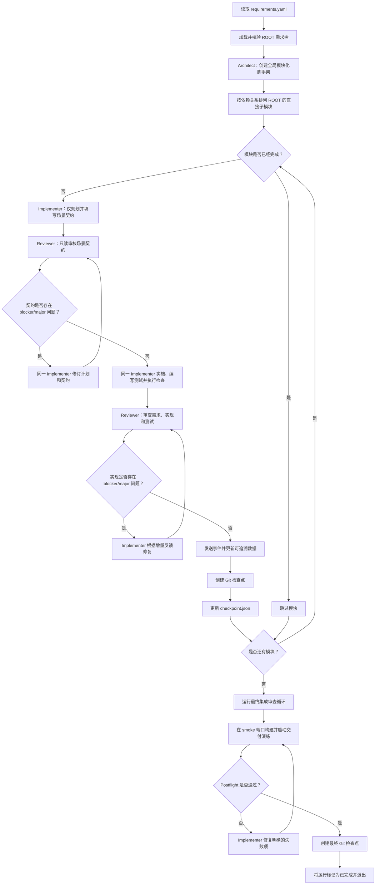

[English](README.md) | [中文](README.zh-CN.md)

# HAFleet ARC

HAFleet ARC 是一个面向 ARC-Bench、生命周期有限的多角色编程智能体。它保留了
HAFleet 的架构师、实现者、审查者、任务状态和检查点等概念，但不会启动 HAFleet
后端、tmux、Matrix 或 Dashboard 服务。

## 入口

ARC-Bench 使用以下方式运行提交：

```bash
python3 main.py /path/to/requirements --output-dir /path/to/output --type web --web-port 3000
```

ARC-Bench Runtime SDK 已内置在 `arcbench-agent-runtime/` 中。直接从源码目录运行时会
自动发现该 SDK，因此不需要额外检出仓库或手动设置 `PYTHONPATH`。

Runner 会提供 `OPENAI_API_KEY`、`OPENAI_BASE_URL`、`MODEL` 以及所有
`ARCBENCH_*` 运行时路径。需求包必须包含一个根节点为 ROOT 的
`requirements.yaml`。

Codex 本地状态隔离在 `.arc/hafleet/codex-home` 下，因为评测主机可能会提供只读的
用户主目录。

## Fleet 工作流

HAFleet ARC 会在需求树上运行一条生命周期有限且可恢复的流水线。核心 Codex 角色
共享同一个输出工作区，并在本次运行期间分别保持持久化的角色会话。



### 1. 初始化工作区

入口程序会校验需求包中是否包含 `requirements.yaml`，其根节点是否为 `id: ROOT`，
以及是否至少包含一个子节点。随后它会：

- 从 `template/<type>/` 复制任务对应的初始模板，同时不覆盖恢复运行时已有的工作；
- 初始化 ARC-Bench 可追溯性存储并记录需求树；
- 确保输出目录是一个 Git 仓库；
- 发送运行开始事件；
- 将 Codex 状态隔离到 `.arc/hafleet/codex-home`，使 Runner 不需要可写的用户主目录。

### 2. 创建全局架构脚手架

在处理功能模块前，一次性运行的 `architect` 角色会读取完整的 ROOT 需求树，写入
`.arc/hafleet/architecture.md`，并创建或重构模块化项目脚手架。对应检查点为
`ROOT: architecture scaffold`；`architecture_completed` 标记使该阶段可以恢复，而
无需重复执行。

完成架构脚手架后，也可以将相互独立的 ROOT 模块分派到不同 worktree：

```bash
python3 main.py /path/to/requirements \
  --output-dir /path/to/output \
  --type web \
  --parallel \
  --max-workers 2
```

并行模式默认关闭，也可以通过 `HAFLEET_PARALLEL=1` 和
`HAFLEET_MAX_WORKERS=2` 启用。每个模块会在独立 worktree 中运行 Implementer（包括
测试编写）和 Reviewer；主工作区按照依赖顺序 cherry-pick 各模块。成功的 worktree
会被删除，失败或发生冲突的 worktree 则保留在 `.arc/hafleet/worktrees/` 下。

### 可选流水线配置

内置流水线维护在 `hafleet_arc/pipeline.yaml`，可以在每个输出工作区中使用
`.arc/hafleet/pipeline.yaml` 覆盖。配置采用带版本的 `agent`、`loop` 和
`operation` 节点；循环节点的 `review`、`repair`、`until` 和 `max_rounds` 字段控制
审查及修复策略。角色 Prompt 也统一维护在该 YAML 的 `roles.<role>` 下。运行级配置
可以只覆盖一个 Prompt，同时继承其他内置角色 Prompt。

省略该文件时，将使用默认的 Architect → Implementer 规划 → 契约审核 → Implementer
实施 → Reviewer 循环 → checkpoint → Postflight 流水线。默认模块流程没有独立的
Planner 或 Tester：规划和实施仍由同一个 Implementer 负责，只在中间插入只读契约
门禁。声明了 `planner` Agent 的旧版或自定义 YAML 仍会由该角色承担规划阶段。

默认流水线的相关部分等价于：

```yaml
nodes:
  - id: implementation_plan
    type: agent
    role: implementer
  - id: contract_review
    type: loop
    mode: contract
    review: reviewer
    repair: implementer
    until: no_major_findings
    max_rounds: 2
  - id: implementer
    type: agent
    role: implementer
```

契约门禁使用独立轮次预算，不会占用后续实现质量审查的轮次。

每个 Turn 和操作都会追加到 `.arc/hafleet/messages.jsonl`。该日志可以持久化并在
重启后回放；Dashboard 的 `/api/stream` 接口使用 Server-Sent Events（以及
`Last-Event-ID`）在虚拟 Agent 聊天室中展示相同的消息。

## 可选的运行 Dashboard

独立的本地 Dashboard 会观察一个输出目录，但不会改变执行流水线。它的 Python
服务提供只读 API，UI 也可以作为独立 Vite 项目运行。Dashboard 会读取
`runner-events.jsonl`、`checkpoint.json`、模块计划、Codex Session JSONL 文件以及
只追加写入的 `.arc/hafleet/messages.jsonl` Agent 消息总线。可以通过以下命令显式
启用集成 Dashboard：

```bash
python3 main.py /path/to/requirements \
  --output-dir /path/to/output \
  --type web \
  --dashboard \
  --dashboard-port 3200
```

也可以使用 `HAFLEET_DASHBOARD=1` 和 `HAFLEET_DASHBOARD_PORT=3200` 配置。打开
`http://127.0.0.1:3200` 即可查看流水线、模块状态、实时 Agent 聊天室、审查轮次、
Codex Session 和可点击的对话详情。Dashboard 仅绑定 localhost，且默认关闭。

进行独立前端开发时，可分别运行 API 和 Vite UI：

```bash
# 终端 1：Dashboard API
PYTHONPATH=. python3 -m hafleet_arc.dashboard \
  /path/to/output \
  --api-only \
  --port 3200

# 终端 2：Dashboard UI
cd hafleet_arc/dashboard/frontend
pnpm install
pnpm dev
```

打开 `http://127.0.0.1:5173`。Vite 默认将 `/api` 请求代理到
`http://127.0.0.1:3200`。可以使用
`DASHBOARD_API_URL=http://127.0.0.1:3210 pnpm dev` 覆盖目标地址，或使用
`VITE_PORT=5174 pnpm dev` 修改前端端口。

构建并预览独立 UI：

```bash
cd hafleet_arc/dashboard/frontend
pnpm build
pnpm preview
```

如果要在运行结束后查看已有输出目录，可将其作为独立只读 Dashboard 提供：

```bash
PYTHONPATH=. python3 -m hafleet_arc.dashboard /path/to/output --port 3200
```

### 3. 构建模块执行计划

ROOT 的每个直接子节点都会成为一个模块。模块按稳定且依赖感知的顺序处理。对子孙
节点的依赖不会限制顶层模块排序；出现依赖环时会回退到源码顺序，避免运行死锁。

### 4. 规划并审核场景契约

`implementer` 会收到完整的需求子树、任务类型、已经完成的模块 ID，以及当前仓库
上下文。它首先将具体实施计划写入：

```text
.arc/hafleet/plans/<module-id>.md
```

在这个仅规划的 Turn 中，HAFleet 还会预生成、并由 Implementer 填写：

```text
.arc/hafleet/contracts/<module-id>.json
```

契约为每个原始 scenario 保留一条稳定记录，包括 GIVEN/WHEN/THEN、计划修改文件、
公开可观察结果、规范 URL、持久状态、测试 ID 和具体断言。若 Implementer 在规划阶段
提前修改业务源码，HAFleet 会恢复这些源码改动，但保留计划和契约产物。

每条场景记录都可以被明确审核，例如：

```json
{
  "scenario_id": "REQ-5.3.9-S002",
  "requirement_id": "REQ-5.3.9",
  "given": [],
  "when": [],
  "then": [],
  "planned_files": ["frontend/src/..."],
  "observable_checks": ["对话框关闭且订单保持不变。"],
  "canonical_url": "/personal-center/orders?tab=uncompleted",
  "durable_state": "订单状态保持未支付。",
  "test_id": "T-REQ-5.3.9-S002",
  "assertions": ["对话框已隐藏。", "订单仍以未支付状态显示。"]
}
```

开始编码前，只读 Reviewer 会把计划和场景契约与原始需求子树、作者提供的参考资源
逐项对照。遗漏或薄弱的场景映射会返回同一个 Implementer 会话修订。该独立门禁由
`pipeline.yaml` 中的 `contract_review` 节点声明，默认最多两轮。若有限轮次仍未收敛，
无人值守模式会先让同一个 Implementer 再执行一次仅规划的最终修订，然后继续实施。
未解决的 blocker/major finding 会按模块持久化，并成为后续实现和实现审核的强制义务；
只有 Reviewer 对最终源码和可执行测试审核通过后才会清除。设置
`HAFLEET_QUALITY_ON_EXHAUSTION=pause` 可改为严格暂停。

确定性契约校验还会拒绝被改写的 GIVEN/WHEN/THEN、重复测试 ID、未解决占位符、含糊的
规范 URL，以及缺失的 URL 或持久状态结果。Reviewer 的结构化 checks 可以使用
`status` 或 `result` 字段。

审核通过后，同一个 Implementer 会话再实现完整需求子树，并使用稳定的场景测试 ID
编写和运行测试。这样既不重新引入 Planner→Implementer 的信息传递，也能在昂贵的
代码实现前发现需求理解偏差。

### 5. 审查循环与修复

Implementer 会直接根据需求场景生成或更新可执行测试，并在结束 Turn 前运行测试。
Web 项目可以使用 `frontend/tests/e2e` 中的 Playwright；测试结果和截图会持久化到
`.arc/hafleet/test-results`。随后，只读 Reviewer 会同时审查原始需求、实现和测试
质量。Blocker/major 问题会路由回 Implementer，由其修复代码和测试后进入下一轮
审查。

`reviewer` 在只读 Codex 沙箱中检查原始需求、实现以及 Implementer 编写的测试用例。
它不会运行测试、启动服务器或安装依赖；它会静态评估上报的测试结果和测试质量，
随后返回结构化 JSON 结论。它绝不会编辑源文件或 Git 状态。问题严重级别包括
`blocker`、`major`、`minor` 和 `info`。Blocker/major 问题会追加到消息总线并路由给
`implementer`，由其修复当前模块。Reviewer 会持续复查，直到模块通过或有界循环
耗尽。确定性项目测试拥有独立的修复预算，因此失败的测试命令不再占用 Reviewer
审查轮次。相同失败第一次无进展时还会获得一次新的诊断修复 Turn，之后才会被判定为
无进展。Minor/info 问题不会阻止创建检查点，但仍会显示在 Dashboard 中。

模块通过审查后，Orchestrator 会：

1. 发送 ARC-Bench 设计和实现事件；
2. 创建名为 `<module-id>: implement and review <module-name>` 的 Git 检查点；
3. 将完成的模块记录到 `.arc/checkpoint.json`。

### 8. 暂停与恢复

Orchestrator 会在阶段边界检查 ARC-Bench 暂停请求。发生暂停时，它会记录当前模块和
阶段、发送暂停事件，并以状态码 `130` 退出。

下次运行时，checkpoint 中已经列为完成的模块会被跳过。因此恢复粒度为模块级：
未完成的模块会重新运行，之前已完成的模块则会保留。

### 9. 运行最终集成审查

所有模块完成后，只读 `reviewer` 会执行一次全项目集成检查。所有回归问题都会通过
同一个消息总线循环发送给 `implementer`。该阶段会运行构建和实际测试，并使应用保持
可运行状态，但不会启动长期运行的服务器。最终检查点提交为：

```text
ROOT: final HAFleet integration review
```

设置 `HAFLEET_FINAL_REVIEW=0` 可以在低成本本地实验中禁用该步骤。

### 10. 验证交付并退出

对于 Web 任务，HAFleet ARC 不会在最终审查后立即报告完成。它会先检查必须存在的
`frontend/` 和 `backend/` 结构，运行与 Grader 相同的 npm 安装和前端构建流程，随后
在隔离的 smoke 端口启动后端并等待 HTTP 响应。Postflight 失败时，具体错误会发送给
Implementer，最多进行两轮修复。

构建和启动演练成功后，HAFleet 默认还会重新运行 ROOT 范围内注册的项目验证命令。
失败结果会发送给新的 Implementer 恢复 Turn，并在 Postflight 修复预算内重新执行演练。
只有交付演练和最终注册验证都成功后，系统才会创建最终 Git 检查点并将 checkpoint
标记为完成。如果有限的无人值守预算耗尽后项目测试仍然失败，生成结果会保留并可交给
评测，但不会写入最终完成 checkpoint，后续运行可以继续收敛。退出前会停止所有演练
进程。

## 可靠性控制

每个 Codex Turn 都有有限的超时时间。遇到临时过载、认证、连接、流式传输或超时错误
时，会使用新的角色会话进行重试。Turn 成功但既没有响应也没有项目文件变更时，也会
被视为空 Turn 并重试。

Web 项目生成期间，Codex 启动的命令会继承 smoke 端口（默认 `3100`）。工作区范围内
的保护机制只会停止当前提交中占用评分端口（默认 `3000`）的进程；它绝不会终止共享
Runner 上的外部监听进程。

| 环境变量 | 默认值 | 用途 |
| --- | ---: | --- |
| `HAFLEET_MAX_ATTEMPTS` | `6` | 单个 Codex 角色 Turn 的最大尝试次数（包含首次尝试） |
| `HAFLEET_RETRY_DELAYS` | `30,60,120,180,300` | 以逗号分隔的重试等待秒数；最后一个值会重复使用 |
| `HAFLEET_TURN_TIMEOUT` | `1200` | 单个 Codex Turn 的最大执行秒数 |
| `HAFLEET_SMOKE_PORT` | `3100` | 生成阶段使用的安全应用端口 |
| `HAFLEET_POSTFLIGHT_REPAIRS` | `2` | 交付演练失败后允许 Implementer 修复的次数 |
| `HAFLEET_FINAL_VERIFICATION` | `1` | 每次交付演练成功后重新运行 ROOT 注册项目测试 |
| `HAFLEET_NPM_TIMEOUT` | `600` | 每个 Postflight npm 命令的超时时间 |
| `HAFLEET_READY_TIMEOUT` | `45` | 交付演练时等待后端就绪的超时时间 |
| `HAFLEET_FINAL_REVIEW` | `1` | 是否启用全项目 Reviewer 检查 |
| `HAFLEET_CONTRACT_REVIEW` | `1` | 是否启用实施前场景契约门禁 |
| `HAFLEET_CONTRACT_MAX_ROUNDS` | `2` | 独立的计划/契约审核与修订轮次 |
| `HAFLEET_POSTFLIGHT` | `1` | 是否启用强制交付演练 |
| `HAFLEET_PARALLEL` | `0` | 是否为独立 ROOT 模块启用 worktree |
| `HAFLEET_MAX_WORKERS` | `2` | 并行模块 worktree 的最大并发数 |

Codex 角色默认使用全局 `MODEL` 环境变量。每个角色都可以通过角色专属变量覆盖它，
且角色专属变量的优先级高于 `MODEL`：

```bash
export MODEL=gpt-5.6-terra
export HAFLEET_ARCHITECT_MODEL=gpt-5.6-sol
export HAFLEET_IMPLEMENTER_MODEL=gpt-5.6-terra
export HAFLEET_REVIEWER_MODEL=gpt-5.6-terra
export HAFLEET_TESTER_MODEL=gpt-5.6-terra
```

支持的变量包括 `HAFLEET_ARCHITECT_MODEL`、`HAFLEET_IMPLEMENTER_MODEL`、
`HAFLEET_REVIEWER_MODEL`、`HAFLEET_TESTER_MODEL` 和
`HAFLEET_POSTFLIGHT_MODEL`。`HAFLEET_PLANNER_MODEL` 仅为声明了独立 Planner 的
旧版或自定义流水线保留。如果角色专属变量未设置或为空，则回退到 `MODEL`；如果两者
均未设置，则由 Codex SDK 选择默认模型。

质量审查循环有明确上限。默认情况下，达到轮次或无进展限制时会记录
`quality_deferred`，并以无人值守方式继续处理剩余模块和最终收敛。项目验证修复拥有
独立的有限预算，不会占用 Reviewer 轮次。当注册项目测试仍然失败时，最终 Postflight
门禁不会创建完成 checkpoint。如果希望使用严格的人工门禁，可设置
`HAFLEET_QUALITY_ON_EXHAUSTION=pause`。

可以使用 `HAFLEET_VERIFICATION_MAX_REPAIRS` 限制确定性测试修复 Turn 数，使用
`HAFLEET_QUALITY_STALL_LIMIT` 控制允许连续出现多少次相同的无进展结果。
`HAFLEET_QUALITY_MAX_ROUNDS` 仍是独立的 Reviewer 审查轮次上限。

`HAFLEET_FINAL_REVIEW=0` 会跳过可选的模型审查，但仍会运行确定性的 Postflight。
`HAFLEET_POSTFLIGHT=0` 只适合低成本本地 Harness 测试；禁用它会失去对交付结果可运行
的保证。

## 本地检查

```bash
python3 -m unittest discover -s tests -v
python3 -m compileall -q main.py hafleet_arc tests
```

提交时，请确保 ZIP 根目录中包含 `main.py`、`hafleet_arc/`、
`arcbench-agent-runtime/`、`template/`、`requirements.txt`，以及可选的 `skills/`。
